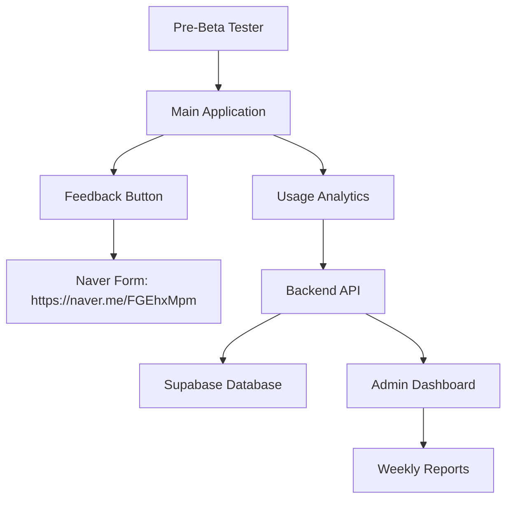

# Pre-Beta Feedback System Design

## Overview

한국공대 전자공학부 편입학생들을 위한 체계적인 Pre-Beta 테스트 시스템을 설계합니다. 이 시스템은 기존 Tino-te.ai 애플리케이션에 네이버 폼 연동 피드백 수집, Pre-Beta 테스터 관리, 사용량 추적 기능을 추가하여 효과적인 베타 테스트 환경을 제공합니다.

## Architecture

### System Components



### Technology Stack
- **Frontend**: Next.js (기존 유지)
- **Backend**: FastAPI (기존 유지)
- **Database**: Supabase PostgreSQL (기존 유지)
- **External Integration**: Naver Form API
- **Analytics**: Custom usage tracking system

## Components and Interfaces

### 1. Pre-Beta Tester Management System

#### Frontend Components
```typescript
// components/FeedbackButton.tsx - 모든 페이지에 표시
interface FeedbackButtonProps {
  position: 'fixed' | 'inline';
  variant: 'primary' | 'secondary';
}
```

#### Backend API Endpoints
```python
# New endpoints in app/main.py
@app.get("/api/v1/admin/pre-beta-testers")
def get_pre_beta_testers(admin: User = Depends(verify_admin))

@app.post("/api/v1/admin/pre-beta-testers")
def add_pre_beta_tester(tester_data: PreBetaTesterCreate, admin: User = Depends(verify_admin))

@app.get("/api/v1/user/is-pre-beta")
def check_pre_beta_status(current_user: User = Depends(get_current_user))
```

### 2. Feedback Integration System

#### Feedback Button Implementation
```typescript
// components/FeedbackButton.tsx
const NAVER_FORM_URL = "https://naver.me/FGEhxMpm";

interface FeedbackButtonProps {
  className?: string;
}

function FeedbackButton({ className }: FeedbackButtonProps) {
  const handleFeedbackClick = () => {
    // 피드백 클릭 로그 기록
    trackFeedbackClick();
    // 네이버 폼으로 리다이렉트
    window.open(NAVER_FORM_URL, '_blank');
  };
}
```

#### Feedback Tracking
```typescript
// lib/feedback-tracking.ts
interface FeedbackClickData {
  userId: string;
  timestamp: Date;
  currentPage: string;
  dayOfWeek: string;
  weekNumber: number;
}

function trackFeedbackClick(): void
function getFeedbackStats(userId: string): FeedbackStats
```

### 3. User Management System

#### Database Schema Extensions
```sql
-- Add to existing users table
ALTER TABLE users ADD COLUMN user_type VARCHAR(20) DEFAULT 'general';
ALTER TABLE users ADD COLUMN beta_start_date TIMESTAMP;
ALTER TABLE users ADD COLUMN beta_end_date TIMESTAMP;

-- New table for beta tester management
CREATE TABLE pre_beta_testers (
    id UUID DEFAULT gen_random_uuid() PRIMARY KEY,
    user_id UUID REFERENCES users(id) ON DELETE CASCADE,
    department VARCHAR(100) DEFAULT '전자공학부',
    student_type VARCHAR(50) DEFAULT '편입학생',
    recruitment_source VARCHAR(100),
    expected_graduation DATE,
    created_at TIMESTAMP DEFAULT NOW()
);

-- New table for feedback tracking
CREATE TABLE feedback_submissions (
    id UUID DEFAULT gen_random_uuid() PRIMARY KEY,
    user_id UUID REFERENCES users(id) ON DELETE CASCADE,
    submission_date TIMESTAMP DEFAULT NOW(),
    page_context VARCHAR(255),
    session_id VARCHAR(255),
    naver_form_url TEXT,
    week_number INTEGER,
    day_of_week VARCHAR(10)
);
```

### 4. Usage Analytics System

#### Analytics Data Collection
```python
# app/analytics.py
class UsageAnalytics:
    def track_feature_usage(user_id: str, feature: str, duration: int)
    def track_session_data(user_id: str, session_start: datetime, session_end: datetime)
    def generate_weekly_report(week_start: date) -> WeeklyReport
    def calculate_academic_improvement_indicators(user_id: str) -> ImprovementMetrics
```

#### Analytics Database Schema
```sql
CREATE TABLE usage_analytics (
    id UUID DEFAULT gen_random_uuid() PRIMARY KEY,
    user_id UUID REFERENCES users(id) ON DELETE CASCADE,
    feature_name VARCHAR(100),
    usage_duration INTEGER, -- in seconds
    session_id VARCHAR(255),
    timestamp TIMESTAMP DEFAULT NOW(),
    metadata JSONB
);

CREATE TABLE weekly_feedback_schedule (
    id UUID DEFAULT gen_random_uuid() PRIMARY KEY,
    week_start_date DATE,
    target_feedback_count INTEGER DEFAULT 3,
    actual_feedback_count INTEGER DEFAULT 0,
    completion_rate DECIMAL(5,2)
);
```

## Data Models

### User Type Enumeration
```python
from enum import Enum

class UserType(str, Enum):
    GENERAL = "general"
    PRE_BETA = "pre-beta"
    ADMIN = "admin"
```

### Pre-Beta Tester Model
```python
class PreBetaTester(BaseModel):
    id: UUID
    user_id: UUID
    department: str = "전자공학부"
    student_type: str = "편입학생"
    recruitment_source: Optional[str]
    expected_graduation: Optional[date]
    beta_start_date: datetime
    beta_end_date: Optional[datetime]
```

### Feedback Submission Model
```python
class FeedbackSubmission(BaseModel):
    id: UUID
    user_id: UUID
    submission_date: datetime
    page_context: str
    session_id: str
    naver_form_url: str
    week_number: int
    day_of_week: str
```

## Error Handling

### Access Control Errors
- **401 Unauthorized**: Non-authenticated users
- **403 Forbidden**: General users trying to access pre-beta features
- **404 Not Found**: Invalid pre-beta tester IDs

### Feedback System Errors
- **500 Internal Server Error**: Naver Form integration failures
- **429 Too Many Requests**: Feedback spam prevention
- **400 Bad Request**: Invalid feedback submission data

### Graceful Degradation
- If Naver Form is unavailable, fallback to email-based feedback
- If analytics system fails, core functionality remains available
- If database connection fails, show cached coming soon page

## Testing Strategy

### Unit Testing
- Access control logic validation
- Naver Form URL generation testing
- Analytics calculation accuracy
- Database query performance

### Integration Testing
- End-to-end feedback submission flow
- User type switching scenarios
- Admin dashboard functionality
- External API integration reliability

### User Acceptance Testing
- Pre-beta tester onboarding process
- Feedback submission user experience
- Coming soon page effectiveness
- Admin management workflow

### Performance Testing
- Concurrent pre-beta tester usage
- Analytics data processing speed
- Database query optimization
- Frontend loading times with access control

## Security Considerations

### Access Control Security
- JWT token validation for user types
- Admin privilege verification
- Session management for pre-beta testers
- Rate limiting for feedback submissions

### Data Privacy
- Pre-beta tester information encryption
- Feedback data anonymization options
- GDPR compliance for user data
- Secure transmission to Naver Forms

### Audit Trail
- All admin actions logged
- User type changes tracked
- Feedback submission history
- System access attempts monitoring

## Deployment Strategy

### Phase 1: Access Control Implementation
1. Deploy coming soon page for general users
2. Implement user type checking
3. Add pre-beta tester management

### Phase 2: Feedback System Integration
1. Integrate Naver Form connectivity
2. Add feedback button to pre-beta interface
3. Implement feedback tracking

### Phase 3: Analytics and Monitoring
1. Deploy usage analytics system
2. Add admin dashboard
3. Implement weekly reporting

### Rollback Plan
- Feature flags for easy disabling
- Database migration rollback scripts
- Frontend component fallbacks
- Emergency admin access procedures